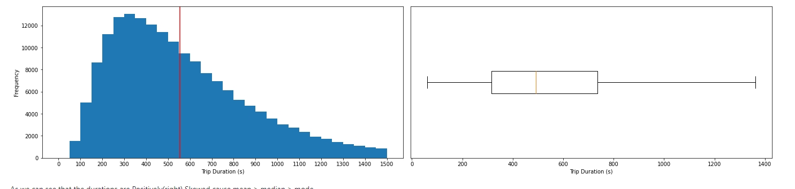
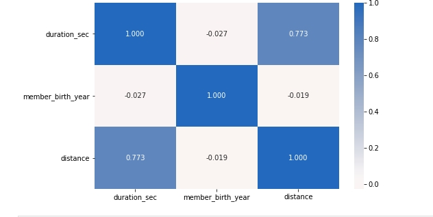
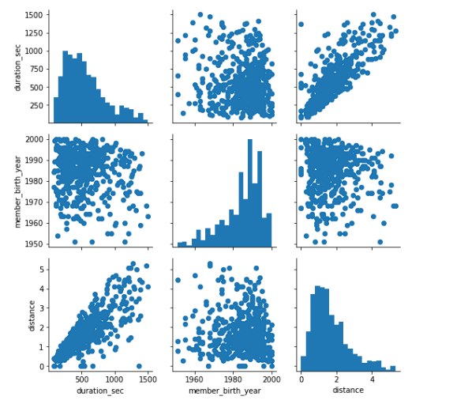
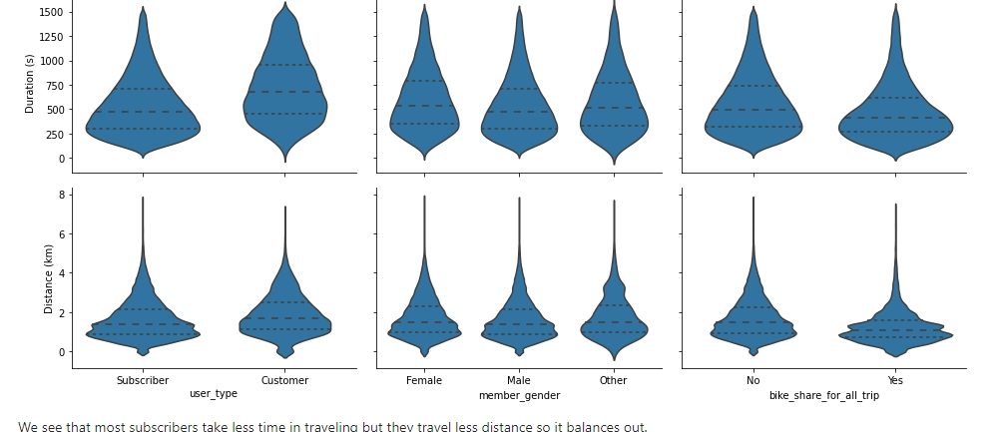
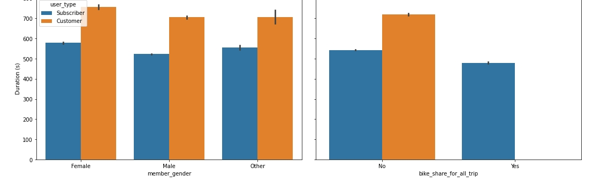
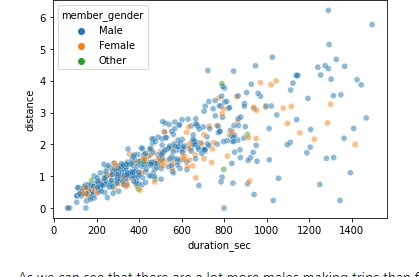
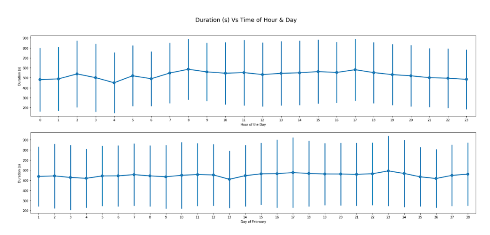

  <h1> Ford GoBike Dataset Exploration</h1>
  
  
  
  
  
  <h3>  Expenseo is a personal expense manager built in flutter with firebase as database, It user firebase email pass auth for authentication and firestore as storage</h3>
  
  

## :star2: About The Project

The data consists of information regarding 183,412 Bike Trips, including :
duration, starting & ending (time, station name, station id, station longitude, station latitude),
user bike id, user type(subscriber or customer), user's birth year, user's gender and bike share on for all the trip .

**Summary of Findings:** 

- Strong relationship between the duration of the trips and the distance between the start and ending stations.
  It's approximately linear between them, while being a customer or a subscriber doesn't have an affect on the duration.
- It was a surprize to find out that age doesn't have an affect on duration as i expected that young will be faster than adults,
- Cycling is not gender bias and being a male or female doesn't have an affect on duration.
- Some outliers with in dataset regarding so low birth year which meant not their real age and the outliers from the duration to focus our exploration on the data that matters.

**Key Insights for Presentation:**

- Distribution of the duration as we found out that most people like to travel roughly 5 minutes and
that makes sense cause we humans get tired quickly and if the trip 
would to talk longer it's better to take a ride on a taxi or the subway

- Affect of time on the duration, it was surprising to see that the day doesn't have an affect cause we expected that duration is less on the weekend days as less traffic but no affect but the hour matters cause the duration is least in the early morning(3 - 5 am) cause less traffic to worry about so they move faste.

